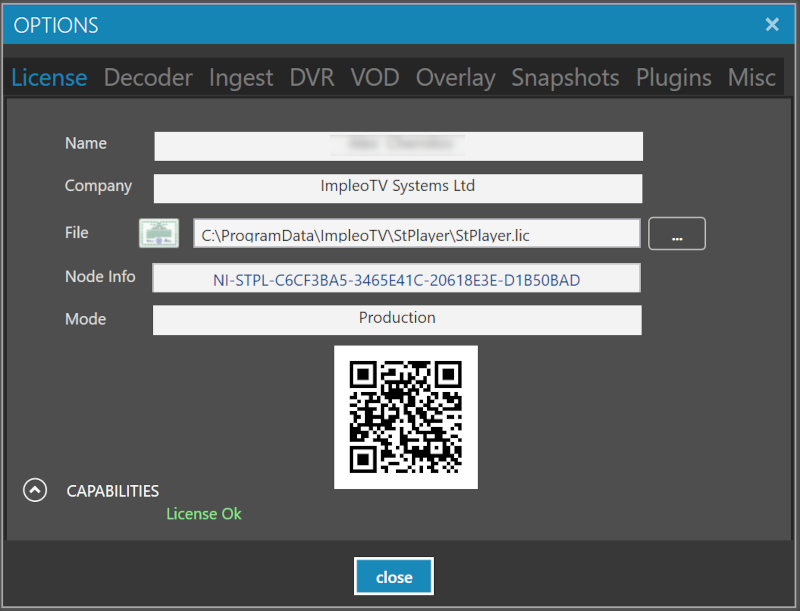

  

# StPlayer

**StPlayer™** is a cost-effective standalone viewer for ISR imagery presentation and analysis.  
More [info](https://www.impleotv.com/content/stplayer/help/index.html).

## System Requirements

OS: Windows 10/11 64 bit.

## Installation

**StPlayer** can be downloaded as a **zip** file that contains the installer.  
Unzip the **SetupStPlayer.zip** file and run the **SetupStPlayer.exe**  

## Download link

|          | Version             | Download link                                                           | 
|:---------|:-------------------:|:------------------------------------------------------------------------|
| **StPlayer** |  v2.3.5 | [SetupStPlayer.zip](https://github.com/impleotv/stplayer-release/releases/latest/download/SetupStPlayer.zip) | 

*Released on Thu, 8 Jan 2026, 08:51 GMT+2*

## License

No license is needed for application evaluation - it will work in demo mode (with some restrictions). 

**StPlayer** is a node-locked software, so you have to get a license (**after purchasing the SW**) in order to lift demo restrictions. Please install the application and fill out an [online form](https://docs.google.com/forms/d/e/1FAIpQLSd_XW6bDsFce1G1cpds4gMQNlwNax0CvkWzcMbscxZ5rLaIbA/viewform), providing the ***Node Info*** string (IMPORTANT!!!) for the target machine.  
***Node Info*** string can be found at ***Options->License***, as shown below.

Copy and paste the **Node Info** string into the online form, or email it to support@impleotv.com.  
If your computer is offline or you're unable to copy the Node Info text, take a photo of the license page with the QR code clearly visible and send it to us instead.

You'll receive a **license** file (or a **license** file and a **key**, for legacy versions).  
To complete activation, select the license file on the Options -> License page. If a key is provided, enter it as well.
