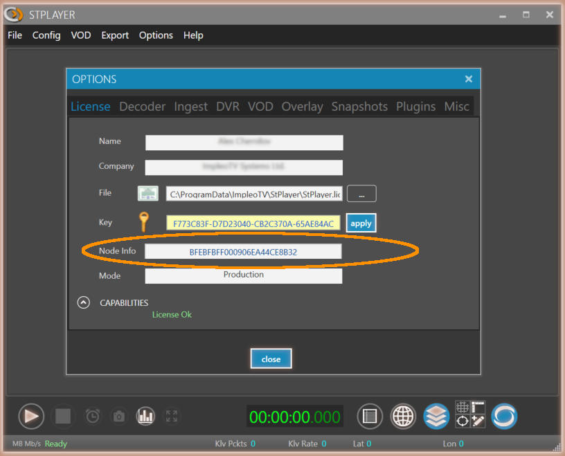

  

# StPlayer
**StPlayer™** is a cost effective standalone viewer for ISR imagery presentation and analysis. More [info](https://www.impleotv.com/content/stplayer/help/index.html).

## System Requirements
OS: Windows 10 64 bit.
## Installation

**StPlayer** can be downloaded as a **zip** file that contains installer. Unzip the **SetupStPlayer.zip** file and run the **SetupStPlayer.exe**

## License

**StPlayer** is a node locked software. In order to activate the license you should send us a *Node Info* string.  
***Node Info*** string can be found at ***Options->License***, as shown below.

Please copy-paste *Node Info*, don't send an image...

You'll get back a **license** file and a **key**.
Select the license file in the *Options/License* page and apply the provided key.
